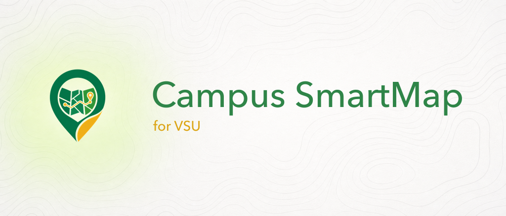

# Campus SmartMap for VSU

Smart, offline-friendly campus navigation for Visayas State University. Browse facilities, search rooms, plan a private weekly class schedule, navigate with real walking routes, find verified off-campus boarding houses, chat with an AI assistant, and manage everything through a secure admin console.



## Quick Links
- Map: `/`
- Schedule: `/schedule`
- Boarding houses: `/boarding-houses`
- Directory: `/directory`
- Events: `/events`
- Chat: `/chat`
- Owner console: `/owner`
- Admin: `/admin`
- Offline page: `/offline`

Project policies: [Contributing](CONTRIBUTING.md) · [Security](SECURITY.md) ·
[Governance](GOVERNANCE.md) · [Data and assets](docs/DATA_AND_ASSETS.md)

## Overview
- Interactive map (OpenFreeMap vector + Esri satellite with place/road labels) with category pins, smart pin declutter, and a selection sheet
- Turn-by-turn walking navigation on a campus path graph, with nearest-gate handoff to real road routing for off-campus starts
- Boarding houses: owner-submitted, admin-verified off-campus listings with multi-room offerings, photos, amenities/safety checklists, reviews, price-anomaly flagging, routed walk times, and student filters
- Directory with search/filter and map handoff; campus events calendar
- Private, offline-first weekly schedule with optional account-owned cross-device sync, conflict warnings, next-class guidance, campus-facility handoff, JSON backup/restore, and ICS export
- AI chat assistant (Gemini via Genkit) with API-key rotation, model fallback ladder, answer caching, per-IP rate limits, and boarding-house awareness
- Interactive per-page guides (spotlight tours) for students, owners, and admins
- User suggestions (add/edit) with admin review and approval
- Offline-ready PWA with cached tiles/data and an offline landing page
- Admin dashboard for facilities/rooms CRUD, boarding-house moderation, navigation graph editing, and AI knowledge management
- Accessibility-focused (keyboardable tabs, focus rings, ARIA labelling)

## Tech Stack
- Next.js 16 (App Router, Turbopack), React 19, TypeScript
- Tailwind CSS + shadcn/ui, lucide-react
- Supabase (Postgres + RLS, Auth, Storage)
- Leaflet + MapLibre GL (vector basemap bridge with a project-owned React adapter)
- Genkit + Google Gemini for chat

## Requirements
- Node.js 22+
- npm 10+
- Docker Desktop, Colima, or another Docker-compatible runtime
- Supabase CLI (the project scripts run the pinned CLI with `npx`)
- Gemini API keys (optional; required only for AI chat)
- Map tiles need no key (OpenFreeMap + OSM/CARTO/Esri public endpoints)

## Getting Started
1. Install the locked dependencies.
   ```bash
   npm ci
   ```
2. Start and reset the project-local Supabase stack, create synthetic fixture
   accounts, and generate an ignored loopback `.env.local`.
   ```bash
   npm run dev:bootstrap
   ```
3. Run the app.
   ```bash
   npm run dev
   ```

The bootstrap refuses non-loopback Supabase URLs and never needs maintainer or
hosted-project credentials. If `.env.local` already targets a hosted project,
move it aside before bootstrapping; the script will not overwrite it.

## Supabase Setup
- Local configuration is committed in `supabase/config.toml` and uses PostgreSQL 17.
- `npm run db:reset` applies every migration and `supabase/seed.sql` only to the local stack.
- `npm run qa:seed` refreshes synthetic boarding-house fixtures; it refuses hosted Supabase URLs.
- See `docs/storage-bucket.md` for the exact public/private bucket contract.

### Google identity for schedule sync

Schedule sign-in uses Google only as a Supabase Auth identity provider. It
requests identity scopes (`openid`, email, and profile); it does not read or
write Google Calendar. This OAuth client is separate from the Gmail OAuth
credentials used for notification email.

Keep the client secret out of git. For local Supabase, set
`SUPABASE_AUTH_EXTERNAL_GOOGLE_CLIENT_ID` and
`SUPABASE_AUTH_EXTERNAL_GOOGLE_CLIENT_SECRET` in the local CLI environment. In
Google Cloud, configure:

- Authorized JavaScript origin: `http://127.0.0.1:57321`
- Authorized redirect URI: `http://127.0.0.1:57321/auth/v1/callback`

For a hosted Supabase project, replace `<project-ref>` and configure:

- Authorized JavaScript origin: `https://<project-ref>.supabase.co`
- Authorized redirect URI: `https://<project-ref>.supabase.co/auth/v1/callback`

Then configure Supabase Auth URL Configuration. Local development allows the
exact application callback `http://127.0.0.1:3000/auth/callback`. Production
uses Site URL `https://vsumap.vercel.app` and the exact redirect
`https://vsumap.vercel.app/auth/callback`. If preview authentication is
intentional, add the narrow Vercel pattern
`https://*-<vercel-team-or-account-slug>.vercel.app/auth/callback`, replacing
the placeholder with the actual slug; do not use a global `**` wildcard.
Preview and production settings must be configured in their corresponding
Supabase projects. These instructions describe required setup and do not imply
that any hosted project is already configured.

## Environment Variables
Notes:
- Variables prefixed with `NEXT_PUBLIC_` are exposed to the browser.
- Keep `SUPABASE_SERVICE_ROLE_KEY` server-only (never expose it in the client).

```
NEXT_PUBLIC_SUPABASE_URL=...           # Supabase project URL
NEXT_PUBLIC_SUPABASE_ANON_KEY=...      # Supabase anon/publishable key
SUPABASE_SERVICE_ROLE_KEY=...          # Service role key (admin actions)
NEXT_PUBLIC_SCHEDULE_ACCOUNT_SYNC_ENABLED=false # Missing/non-true disables account sync
SUPABASE_AUTH_EXTERNAL_GOOGLE_CLIENT_ID=...      # Local Supabase Auth provider
SUPABASE_AUTH_EXTERNAL_GOOGLE_CLIENT_SECRET=...  # Local only; never expose to browser
NEXT_PUBLIC_TURNSTILE_SITE_KEY=...     # Cloudflare Turnstile site key
TURNSTILE_SECRET_KEY=...               # Cloudflare Turnstile server secret
ABUSE_RATE_LIMIT_PEPPER=...            # Long random server-only value
BREAK_GLASS_ADMIN_USER_IDS=...         # Comma-separated auth user ids that always resolve as admin
NEXT_PUBLIC_GEOAPIFY_KEY=...           # (optional) walking-route provider — see Routing below
NEXT_PUBLIC_ORS_KEY=...                # (optional) OpenRouteService key — alternative provider
GEMINI_API_KEYS=key1,key2,...          # Comma-separated Gemini API keys (rotated per request)
GEMINI_MODEL_IDS=gemini-3.1-flash-lite,gemini-3.5-flash,gemini-2.5-flash-lite,gemini-2.5-flash  # Ordered fallback ladder (lite-first for free-tier quota)
```

### Routing (walking directions + boarding-house walk times)
Off-campus navigation and the boarding-house "walking time" use a real walking
router. With **no key**, requests use the keyless **OSRM-DE** foot router
(`routing.openstreetmap.de`) — works out of the box but is a community demo
(~1 req/s, no SLA, non-commercial), so under load some results fall back to a
labelled straight-line estimate. For production, set **one** free key
(precedence: Geoapify → OpenRouteService → OSRM):

- **Geoapify** (recommended) — https://geoapify.com. Free, no card, 3000/day.
  Restrict the key to your domain in the dashboard, then set `NEXT_PUBLIC_GEOAPIFY_KEY`.
  Keep the "Powered by Geoapify" attribution.
- **OpenRouteService** — https://account.heigit.org. Free, no card, 2000/day,
  cleanest self-host path. Set `NEXT_PUBLIC_ORS_KEY`. Its key can't be
  domain-locked, so prefer it for low-traffic / non-commercial use.

On-campus routing runs on an admin-editable path graph (nodes/edges with gate
nodes marking the external↔internal handoff); routes from outside campus enter
through whichever gate minimizes total detour.

## Scripts
- `npm run dev` — start Next.js (Turbopack)
- `npm run db:start` — start the isolated local Supabase stack
- `npm run db:reset` — reset only the local database and apply migrations/seeds
- `npm run dev:bootstrap` — start/reset local Supabase and create safe fixtures
- `npm run build` — production build
- `npm run start` — serve production build
- `npm run lint` — ESLint
- `npm test` — unit tests (node:test via tsx)
- `npm run qa:rls` — adversarial RLS smoke test against loopback Supabase
- `npm run ai:dev` — start Genkit dev server

## Project Structure
- `app/(student)` — student-facing map, schedule, boarding houses, directory, events, chat, info, offline
- `app/owner` — boarding-house owner console (listings, offerings, photos, vacancy)
- `app/admin` — admin shell: facilities/rooms CRUD, boarding-house moderation, navigation editor, AI knowledge
- `app/api` — API routes (chat)
- `components` — shared UI/map/boarding-house/owner/admin/chat components
- `lib` — supabase clients, queries, context, constants, AI helpers, pathfinding
- `public/sw.js` — custom service worker for offline caching

## Offline & PWA
- Service worker caches static assets and map tiles (OpenFreeMap/OSM/CARTO/Esri hosts). API, auth, Supabase REST/RPC, and non-GET requests are always network-only.
- The `/schedule` shell works offline. Personal course payloads remain in account-scoped IndexedDB and are never copied into service-worker Cache Storage.
- Schedule facility fields use the same ranked name, code, alias, and room search as the campus map and remain cache-first when connectivity is limited.
- Guest schedules make no schedule network requests. Optional account sync stores courses in private, account-owned Supabase rows for cross-device use; it does not share them with Google or Google Calendar.
- JSON backup and ICS exports contain schedule details. Store and share them as sensitive files, and export a JSON backup before clearing browser data or deleting account data.
- Offline page at `/offline` with retry/back-to-map actions
- Facilities and chat history cached locally (with TTL/quotas)
- Manifest/icons included for installability; theme color matches brand green
- The Android app is a TWA wrapper around the deployed site, so web deploys update mobile automatically

## Roles & Access
- Students browse anonymously; writing reviews requires Google sign-in
- Boarding-house owners sign in with Google and manage listings at `/owner`; substantive edits to a live listing send it back to admin review
- Admin console at `/admin` (Supabase Auth email/password + break-glass allowlist)
- Server actions require `SUPABASE_SERVICE_ROLE_KEY`; RLS is the hard backstop for public reads

## Contributing
- Base branch: `main`; open a pull request from a focused branch
- Branch naming: `feature/<slug>`, `fix/<slug>`, `docs/<slug>`, or `chore/<slug>`
- Commits: Conventional Commits (`feat(scope): ...`, `fix(scope): ...`, `docs(scope): ...`, `chore(scope): ...`)
- Read `CONTRIBUTING.md`, keep PRs focused, and run the documented quality gates before opening a PR

## QA & Verification
- Lint: `npm run lint`
- Unit tests: `npm test`
- Types: `npm run typecheck`
- Build: `npm run build`
- RLS: `npm run qa:rls`
- Manual flows to verify before release:
  - Map load, pin selection/declutter at multiple zooms, category filter, search, navigation (on- and off-campus start)
  - Boarding houses: filters, detail page (photos zoom, room options, reviews), owner create/edit → admin review → publish
  - Directory search/filter and "View on Map" handoff; events list
  - Schedule: tab visibility/reset, add/edit/delete, conflicts and TBA locations, facility map handoff, JSON restore, ICS download, reload, and offline reload
  - Chat: send/stream responses, boarding-house questions, follow-ups, rate-limit messaging
  - Suggest add/edit flows and admin approval/rejection
  - Admin CRUD (facilities, rooms, images, history) and boarding-house moderation
  - Offline: visit `/offline`, toggle network to confirm cached tiles/data
  - PWA install prompt on mobile/desktop

## Deployment Notes
- Ensure env vars are set in the hosting platform (Supabase + Gemini; routing key optional)
- Turbopack root is pinned in `next.config.ts` to avoid multi-lockfile resolution issues
- Use `npm run build && npm run start` for production runs

### Schedule sync rollout, privacy, and rollback

`NEXT_PUBLIC_SCHEDULE_ACCOUNT_SYNC_ENABLED` is disabled-first: missing values
and every value other than the literal `true` keep the local guest planner.
Apply the schedule migration and pass RLS isolation checks before enabling a
preview. Keep production set to `false` for the first compatible application
deployment, apply and verify the production schema separately, and enable it
only in a later deliberate deployment. Do not treat this repository
configuration as evidence that production OAuth, schema, or flags are active.

Guest schedules stay on the current device unless the student explicitly signs
in and consents to copying or reconciling them with an account. Signing in alone
does not upload the guest schedule. Students can remove the local account copy
from a shared browser without deleting the cloud copy. Deleting an account
schedule clears active cloud payloads and retains only content-free
synchronization tombstones so offline devices cannot resurrect deleted courses;
account deletion must invoke the same schedule deletion path before the auth
user is removed. A JSON backup should be offered before destructive deletion.

Forward rollback means deploying the compatible app with account sync disabled,
not reverting the database migration. This revokes browser access to the sync
path while retaining private user rows and tombstones for a later re-enable or
controlled deletion. Keep RLS in force during rollback.

The daily retention endpoint also requires server-only `CRON_SECRET`,
`NEXT_PUBLIC_SUPABASE_URL`, and `SUPABASE_SERVICE_ROLE_KEY`. Vercel Cron must
send the exact bearer secret. The service-role key must never enter client
bundles; it is required for bounded retention and account-deletion operations.
After deployment, verify the scheduled job and its logs rather than assuming
cleanup is active.

## License

Project-authored code and assets are available under the [MIT License](LICENSE).
University names, marks, third-party data, and external map services retain
their respective rights and terms.

## Troubleshooting
- Turbopack root warnings: already pinned via `turbopack.root` in `next.config.ts`
- Stale browser baseline warning: update `baseline-browser-mapping` (dev dep) if tooling requests
- Service worker cache misses: clear browser storage and revisit the map to warm caches
- Blank picker maps: Leaflet surfaces need raster tile URLs (`MAP_TILES.rasterStreetUrl`/`rasterDarkUrl`), not the MapLibre vector style URLs
